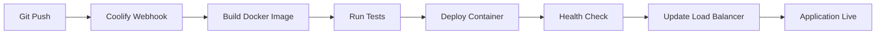

# Farmer Credit Scoring System - Coolify Deployment Guide

## 🚀 Deploying with Coolify

Coolify makes it super easy to deploy your Farmer Credit Scoring System with automated CI/CD and a beautiful web interface.

### 📋 Prerequisites

- Coolify instance running (self-hosted)
- Git repository (GitHub, GitLab, or Gitea)
- Domain name (optional but recommended)

### 🔧 Coolify Setup Steps

#### 1. **Prepare Your Repository**

Make sure your repository has these files:
- ✅ `Dockerfile` or `Dockerfile.coolify`
- ✅ `.env.example`
- ✅ `coolify.yml` (optional, for advanced config)
- ✅ Application code

#### 2. **Create Application in Coolify**

1. **Login to Coolify Dashboard**
   ```
   https://your-coolify-domain.com
   ```

2. **Add New Application**
   - Click "Applications" → "New Application"
   - Choose "Git Repository"

3. **Configure Repository**
   ```
   Repository URL: https://github.com/your-username/farmer-credit-scoring
   Branch: main
   Build Pack: Docker
   ```

4. **Docker Configuration**
   ```
   Dockerfile Path: ./Dockerfile.coolify
   Docker Context: .
   Port: 8501
   ```

#### 3. **Environment Variables**

Set these in Coolify's Environment tab:

```bash
# Core Application
PYTHONPATH=/app
STREAMLIT_SERVER_PORT=8501
STREAMLIT_SERVER_ADDRESS=0.0.0.0
STREAMLIT_SERVER_HEADLESS=true

# Security (use Coolify's secret generator)
SECRET_KEY={{GENERATE_SECRET}}
JWT_SECRET={{GENERATE_SECRET}}

# Database
DATABASE_URL=sqlite:///data/farmsky.db

# Redis (if using Coolify's Redis service)
REDIS_URL=redis://redis:6379/0

# Feature Flags
ENABLE_MODEL_TRAINING=true
ENABLE_DATA_GENERATION=true
ENABLE_BATCH_PROCESSING=true
```

#### 4. **Add Redis Service (Optional)**

1. Go to "Services" → "Add Service"
2. Choose "Redis"
3. Configure:
   ```
   Name: farmsky-redis
   Version: 7-alpine
   Memory Limit: 256MB
   ```

#### 5. **Configure Volumes**

Add these persistent volumes:
```
/app/data → ./data (for training data)
/app/models → ./models (for ML models)
/app/results → ./results (for analysis results)
/app/logs → ./logs (for application logs)
```

#### 6. **Setup Domain & SSL**

1. **Add Domain**
   - Go to "Domains" tab
   - Add your domain: `farmsky.yourdomain.com`

2. **Enable SSL**
   - Toggle "Enable SSL"
   - Coolify will auto-generate Let's Encrypt certificate

#### 7. **Deploy**

1. Click "Deploy" button
2. Monitor build logs in real-time
3. Access your app at your configured domain

### 🔧 Advanced Configuration

#### **Custom Build Args**
```dockerfile
ARG ENVIRONMENT=production
ARG MODEL_VERSION=latest
```

#### **Health Checks**
```yaml
healthcheck:
  path: /_stcore/health
  port: 8501
  interval: 30s
```

#### **Resource Limits**
```
Memory: 2GB
CPU: 1 core
Storage: 20GB
```

### 📊 Coolify Features for Your App

#### **Automatic SSL**
- Free Let's Encrypt certificates
- Auto-renewal
- HTTPS redirect

#### **Zero-Downtime Deployments**
- Rolling deployments
- Health check validation
- Automatic rollback on failure

#### **Built-in Monitoring**
- Resource usage graphs
- Application logs
- Performance metrics

#### **Auto-scaling (Pro)**
- CPU-based scaling
- Memory-based scaling
- Custom metrics

### 🔍 Environment-Specific Configs

#### **Development**
```env
LOG_LEVEL=DEBUG
ENABLE_MODEL_TRAINING=true
CACHE_TTL=300
```

#### **Staging**
```env
LOG_LEVEL=INFO
ENABLE_MODEL_TRAINING=true
CACHE_TTL=1800
```

#### **Production**
```env
LOG_LEVEL=WARNING
ENABLE_MODEL_TRAINING=false
CACHE_TTL=3600
```

### 📈 Deployment Workflow



### 🛠 Useful Coolify Commands

#### **Via Coolify CLI**
```bash
# Deploy specific branch
coolify deploy --branch=feature/new-model

# Scale application
coolify scale --replicas=3

# View logs
coolify logs --follow

# Backup data
coolify backup create
```

#### **Via API**
```bash
# Trigger deployment
curl -X POST "https://coolify.domain.com/api/applications/{id}/deploy" \
  -H "Authorization: Bearer YOUR_TOKEN"

# Get application status
curl "https://coolify.domain.com/api/applications/{id}/status" \
  -H "Authorization: Bearer YOUR_TOKEN"
```

### 🔧 Troubleshooting

#### **Build Failures**
1. Check build logs in Coolify dashboard
2. Verify Dockerfile syntax
3. Check resource limits

#### **Application Won't Start**
1. Review environment variables
2. Check health check endpoint
3. Verify port configuration

#### **Performance Issues**
1. Monitor resource usage
2. Check application logs
3. Optimize Docker image size

### 📚 Best Practices

#### **Repository Structure**
```
farmer-credit-scoring/
├── Dockerfile.coolify     # Optimized for Coolify
├── .env.example          # Environment template
├── coolify.yml           # Coolify configuration
├── app.py               # Main application
├── requirements.txt     # Python dependencies
├── data/               # Persistent data
├── models/            # ML models
└── docs/             # Documentation
```

#### **Environment Management**
- Use Coolify's secret management
- Keep sensitive data out of git
- Use different configs per environment

#### **Performance Optimization**
- Use multi-stage Docker builds
- Implement proper caching
- Monitor resource usage

### 🎯 Production Checklist

**Before Deployment:**
- [ ] Update environment variables
- [ ] Configure custom domain
- [ ] Setup SSL certificate
- [ ] Configure health checks
- [ ] Set resource limits
- [ ] Test backup/restore

**After Deployment:**
- [ ] Verify application is accessible
- [ ] Test all features
- [ ] Monitor logs and metrics
- [ ] Setup alerts
- [ ] Document access credentials

### 📞 Support & Resources

- **Coolify Docs**: [https://coolify.io/docs](https://coolify.io/docs)
- **Community**: Discord/GitHub Discussions
- **Status Page**: Monitor your deployments

---

**Your Application URL**: `https://farmsky.yourdomain.com`  
**Coolify Dashboard**: `https://your-coolify-instance.com`  
**Deployment**: One-click from git push! 🚀